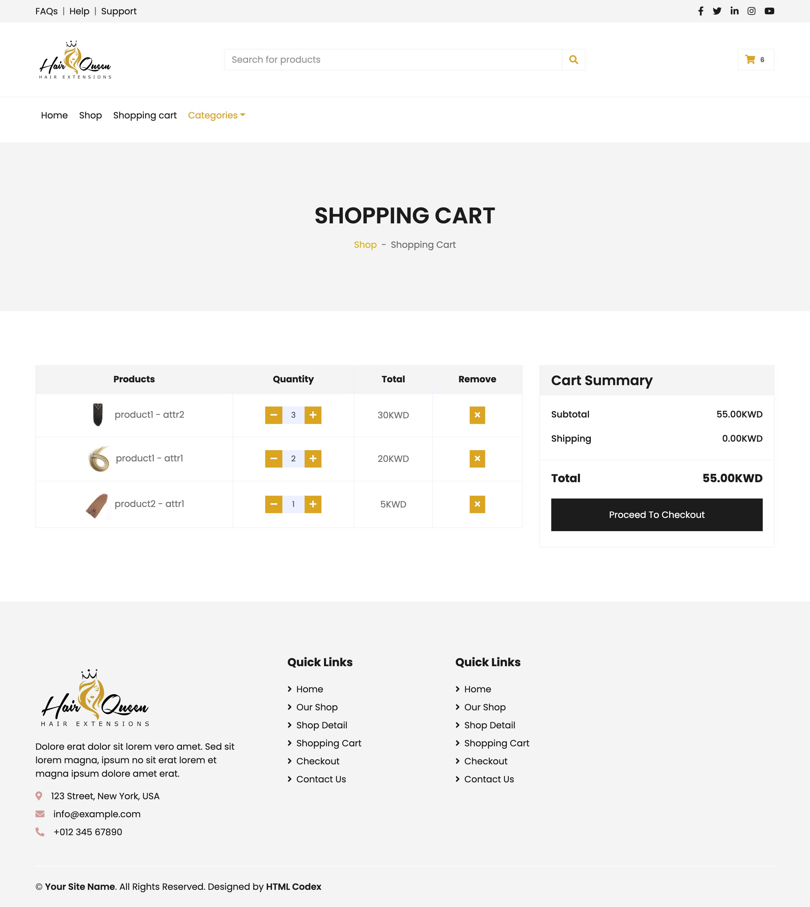

# E-commerce store
E-commerce store app is a fully functional online store built as a sample project. 
It's used for small businesses to sell their products online.

## Features
- Filtering and searching products
- Product specifications
- Add and remove items from cart
- Createing orders
- Connect clinet to seller's whatsApp
- Generating order URLs
- Fully functional admin panel

## Tech
- Python
- Django
- PostgreSQL
- Bootstrap
- javascript 


## Installation

Clone git repo.
```
 git clone https://github.com/hsnkh12/ecommerce-store.git
```
Create your python virtual environment.
```
python3 -m venv env
```
Activate it and install requirements needed.
```
source env/bin/activate
```
```
pip3 install -r requirements.txt
```
Add your cloudinary information in core/settings.py to save images in cloud.
```
import cloudinary
import cloudinary.uploader
import cloudinary.api

cloudinary.config( 
  cloud_name = "", 
  api_key = "", 
  api_secret = "" 
)

DEFAULT_FILE_STORAGE = ''
```
Add your whatsApp number in apps/orders/views.py
```
orderURL = f'/'
message = f'My Order: {orderURL}'
phone_number = '' # Add it here

return redirect(f'https://wa.me/+{phone_number}/?text={message}')
```
Run the server and test the the app.
```
Python3 manage.py runserver
```


## UI representation using HTML/javascript/bootstrap

### Home page


### Products page


### Product detail page


### Cart page


### Checkout page


